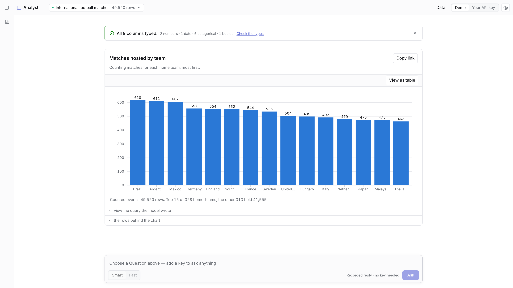
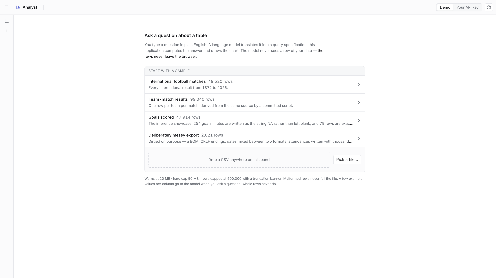
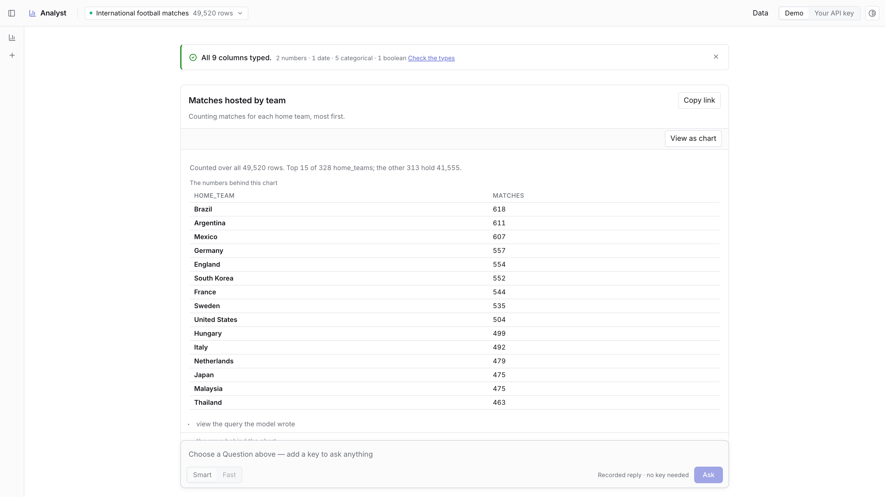
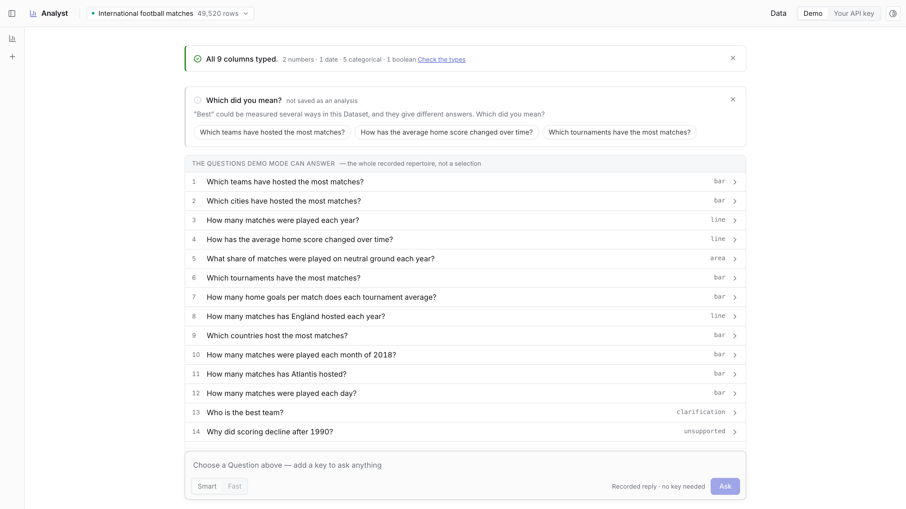
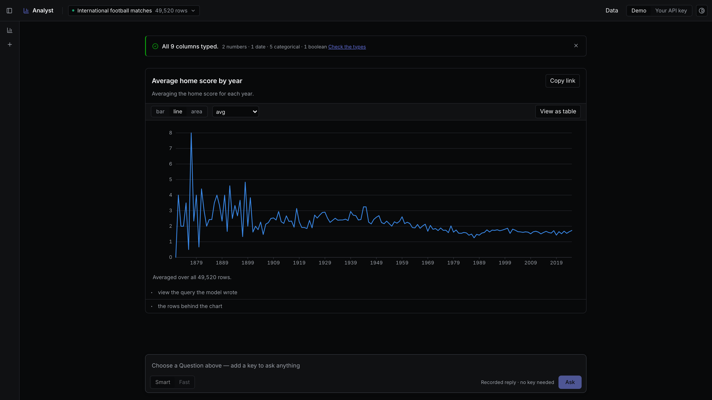

# AI Data Analyst

**Ask a question about a table in plain English. The model writes the query; the application
computes the answer.**

**[Try it live](https://ai-data-analyst-lake.vercel.app/)** — no signup and no key. Demo mode
answers sixteen recorded Questions through the same grammar, validator, worker and renderer a
live key uses; only the transport is replayed.



A browser workspace for exploring a tabular Dataset by asking questions in English. The model
translates a Question into a validated analysis specification; the application executes it and
draws the result. **The model never returns a number, a finding, or a claim about the data** — every
figure on screen was computed from the rows by code you can read.

No backend. The rows are parsed and held in a Web Worker in the tab; they are never uploaded
anywhere, and they are never sent to the model.

## Why it is built this way

An LLM asked to read a table and report a figure will sometimes invent one, and nothing downstream
can tell the difference. The premise here is to never put it in that position: the model is given
the column names and their types — never the rows — and its only job is to choose, from a small
grammar the application can execute, which query to run. Every number on screen is then computed
locally and is reproducible by inspection.

That constraint is the project. It buys a guarantee about correctness and privacy, and it costs a
ceiling on what can be asked; both are measured and written down below rather than glossed.

## What it looks like

| | |
|---|---|
| <br>**Start with a sample or drop a CSV.** Four built-in datasets, or any file — parsed in the tab, never uploaded. | <br>**Every chart is also a table.** The accessible representation is a product feature, and the chart test harness. |
| <br>**An ambiguous Question is asked back.** The options are themselves Questions inside the grammar. | <br>**Both themes are contrast-audited** by `npm run audit:contrast`, which exits non-zero on a regression. |

## Tech stack

| | |
|---|---|
| **Application** | React 19, TypeScript 7, Vite 8 |
| **State** | Zustand, with the Request lifecycle in a plain facade rather than the store |
| **Model** | `@anthropic-ai/sdk` — streamed **tool use**, Claude Sonnet 5 and Haiku 4.5 behind one picker |
| **Grammar & validation** | Zod 4 for the structure, a hand-written semantic validator for the Dataset |
| **Data** | A Web Worker owning a columnar, typed-array ColumnStore; PapaParse for CSV |
| **Charts** | `d3-scale` / `d3-shape` / `d3-array` / `d3-quadtree` with hand-rendered axes — no charting library |
| **UI** | TanStack Table for the virtualized row grid, Radix for menus and tooltips, Lucide icons |
| **Tests** | Vitest across three projects (Node, jsdom, real browser) and Playwright for e2e and benchmarks |

The four pieces of deliberate complexity — the hand-rolled worker RPC, the d3 submodules, the
columnar store and the absence of TanStack Query — are argued in
[ADR-0013](docs/adr/0013-deliberate-complexity-is-spec-mandated.md) rather than left to be
discovered.

## Running it

```
npm install
npx playwright install chromium     # for the browser tests and the bench driver
npm run dev                         # http://localhost:5173
```

**Demo mode is the default**, with no key: it answers a fixed repertoire of sixteen Questions by
replaying recorded Fixtures. Only the transport is replayed — the same Zod grammar, the same
semantic validator, the same worker and the same renderer run as with a key, which is the whole
argument for Fixtures over a proxy. The Fixtures are currently *hand-authored against the real
grammar rather than captured from the API*, because this repository has no key; the wording is
mine, the structure is the model's.

**Your API key** switches the Translator and nothing else, so any Question can be asked. The key is
verified with a one-token call before the mode flips, lives in a module variable for the life of the
tab, and is never written to `localStorage` and never put in the link.

## What the model does, and what it never does

One Question plus the DatasetSchema goes out; a ModelReply comes back as **streamed tool
use**, and it is exactly one of three kinds: an AnalysisSpec, a Clarification with 2–4 options, or
an Unsupported notice with nearby Questions that are inside the grammar.

The tool's `input_schema` is generated from the Zod grammar at module init, so the two cannot drift.
A reply then passes two deliberately separate layers:

- **Structural** — Zod, Dataset-independent: shapes, enums, required fields.
- **Semantic** — a pure function against the loaded DatasetSchema: does the column exist, is the
  measure numeric, is this aggregation legal for this ColumnType, is the groupBy cardinality
  survivable, do the Visualization's fields exist in the **output** of the Operation rather than
  merely in the source columns.

The tools are deliberately **not** `strict`: a strict tool makes the API compile a decoding
grammar, and this one — a seven-field Operation carrying a six-variant Filter union — is too
large for it to compile at all, so every request 400s. The Zod parse at `message_stop` is what
enforces the shape (ADR-0025). Even so, "we Zod-validate untrusted LLM output" is not the
interesting part. The semantic layer is: it is the one that knows about *this* Dataset. A reply that fails it gets exactly one **Repair** — the SpecViolations are sent back for
the model to correct — and then a recoverable error on the card. Transport failures (429, 529, a
dropped connection) are a different bounded loop with a visible countdown, and a wait never
consumes the Repair.

The one sentence the model streams is the Narration: a restatement of the intent it understood,
shown before any data moves. It is the only model-written text in the interface. The chart's caption
is a ChartSummary, computed by the application from the AnalysisResult.

What is sent: the column names, their inferred types, and a few example values per column. What is
not sent: the rows. `src/ai/prompt.ts` builds that request and `tests/workspace/prompt.test.ts`
asserts no row of the Dataset reaches it.

## Performance, honestly

> **Aggregation is the cheapest step and is not the justification for the worker.**

Grouping already-parsed rows is tens of milliseconds, and `postMessage`-ing rows to a worker costs
more serialization than the compute it escapes. The worker exists to **own the Dataset** — to keep
CSV parsing, type inference and coercion, column encoding, RowIndex construction and locale-aware
string sorting off the main thread. Aggregation runs there because that is where the data lives.

The `#/bench` route runs three paths — naive row-objects on the main thread, columnar on the main
thread, columnar in the worker — nine times each, reporting medians with min/max. Raw JSON is
committed in [`docs/bench/`](docs/bench/), each file naming its own machine, browser and headless
flag. On a MacBook Pro (Apple M3 Max, 36 GB, macOS 26.5.1) in HeadlessChrome 151:

**99,040 rows, a question that produces 98,899 points** (`docs/bench/team_matches-99040.json`):

| path | total, median of 9 | long tasks, 9 runs | main thread blocked |
|---|---|---|---|
| naive rows, main thread | 158 ms | 8 × ~148 ms | **1,189 ms** |
| columnar, main thread | 337 ms | 8 × ~330 ms | **2,627 ms** |
| columnar, worker | 360 ms | none | **0 ms** |

Read the last column, then read the first. **The worker path is 23 ms slower end to end** and it is
the one worth shipping, because the 2,627 ms the columnar main-thread path spends blocked is 2,627 ms
in which the page cannot scroll, hover, or answer a click. Zero long tasks is the money number, and
it is about parse, inference, encoding and sort — not about groupBy.

Two more things the table says out loud rather than hiding:

- **Columnar aggregation is not faster here.** Over 98,899 groups it is 122 ms against the object
  path's 34 ms; on the ordinary 49,520-row question it is 9.7 ms against 8.3 ms. Dictionary decode
  and typed-array indexing buy memory and ownership, not a tighter loop, and the brief's claim of
  one did not survive measurement.
- **The naive path looks good on total time and that is the point.** A single number that ignores
  where the time is spent picks the wrong architecture; this is the interrogation the framing above
  exists to survive. [ADR-0004](docs/adr/0004-the-worker-is-not-for-aggregation.md) is the short
  version.

**49,520 rows, 16 bars** (`docs/bench/matches-49520.json`) — the ordinary case, for scale: 62 ms
naive against 108 ms columnar on the main thread and 111 ms through the worker, blocking 459 ms,
824 ms and 0 ms respectively across the nine runs.

**Memory.** The ColumnStore is counted rather than sampled: 2.23 MB for 49,520 rows, 4.83 MB for
99,040. Exactly, for the typed arrays, which know their own `byteLength`; as V8's worst case for
the strings a dictionary holds, charged at 16 bytes of header plus two per code unit, so the
figure is an upper bound and never rounds down. The row-objects comparison is a DevTools heap
snapshot and has not been taken, so no ratio is claimed here. `performance.memory` is quantized
and reported the same 45.2 MB for all three paths, so it is not in the bench at all.

**Rendering.** A scatter switches from SVG circles to one canvas per Series past 5,000 points; the
`d3-quadtree` hit-test feeds the same tooltip either way, so hovering behaves identically across the
switch ([ADR-0023](docs/adr/0023-the-point-budget-belongs-to-the-chart-type.md)). One frame of a pan
over 98,899 points costs a median 4.4 ms (`docs/bench/canvas-pan.json`) — with one recorded anomaly:
a frame that lands the view exactly back at the origin costs about five times that, reproducibly,
cause not established. It is in the JSON under `anomaly` rather than smoothed away. The shape that
Dataset draws is two small-integer measures overplotting onto a grid, because nothing in it is
continuous.

**Interaction.** Long-task and Event Timing observers are installed before anything else in
`main.tsx`, so they cover a whole session, and `#/bench` reports them. INP can only come from
a real interaction, so the scripted Playwright flow is where a figure comes from at all: one such
session reported 0 long tasks, 0 ms blocked, and a slowest interaction of 32 ms.

Reproduce any of it — the argument is reproducibility by a stranger, not a table in a README:

```
npm run dev
node scripts/bench-run.mjs --machine "your machine here" --runs 9
```

## The grammar ceiling

The Operation grammar is deliberately small: up to 5 AND-ed filters, up to 2 grouping columns, one
time bucket (day/week/month/quarter/year), up to 3 aggregations from
`sum · avg · count · countDistinct · min · max · median · rate` — `rate` being percentage-true over
a boolean, which is a first-class ColumnType here alongside number, date and categorical — one
derived ratio, a sort and a limit. Drawn as a bar, line, area or scatter chart.

It **cannot** express joins or multiple tables, window functions, period-over-period comparisons
("vs last month"), per-group growth ranking ("which region grew fastest"), cohorts, forecasting,
causal "why", OR-ed or nested filters, or arbitrary expressions beyond that one ratio.

That ceiling is the direct, accepted consequence of not sending rows to the model: what the model
cannot see, it cannot be trusted to compute, so it is only allowed to choose from a vocabulary the
application can execute and verify. Hitting the ceiling is never an error — an Unsupported reply
names the boundary and offers 1–3 nearby Questions that are inside it, and both it and a
Clarification are card variants in the same flow. A designed refusal that names its own boundary is
a better artifact than a bigger grammar.

## No backend — the proxy trade-off

> A proxy would be ~40 lines and would let visitors use the AI without a key. I chose fixture
> replay because it gives the same visitor outcome with zero infrastructure and zero cost exposure,
> and the same fixture layer is the Playwright mock. BYOK is the unlimited path. If this were a
> product, the proxy is the first thing I'd add — for rate limiting and prompt management, not for
> secrecy.

That dual use is real and not rhetorical: `scripts/e2e-run.mjs` builds its canned SSE frames out of
the same `src/ai/fixtures.ts` that Demo mode replays.

The visitor's key therefore goes from their browser straight to the API, with
`dangerouslyAllowBrowser` and the header that acknowledges it. The trade is stated in the key dialog
as well as here. The SDK's own silent retry is turned off — a wait the visitor cannot see is a wait
they cannot understand — so the retry, the countdown and the single Repair are all on screen.

## The model comparison — outstanding

The comparison this README is supposed to carry — the same 20 Questions through both models,
reporting spec-correctness rate, latency and cost — **has not been run**, because it needs a live
API key and this repository has none. It is unticked on the ledger rather than estimated. Two
smaller items wait on the same key: verifying that prompt caching actually reports
`cache_read_input_tokens > 0`, and re-recording the sixteen Fixtures from the API instead of
hand-authoring them.

What is in place and testable without a key:

- Two models behind one picker — **Smart** (`claude-sonnet-5`, adaptive thinking at low effort) and
  **Fast** (`claude-haiku-4-5`, no thinking, roughly a third of the cost) — with a per-model request
  normalizer, because the two generations genuinely do not accept the same request: `effort` errors
  on the older one, and `temperature` and `budget_tokens` are a 400 on the newer.
- Which model produced a Revision is recorded on it and shown on the card.
- A per-Request usage readout with the cached-input count as its own figure, priced from the
  published rates, and labelled "recorded" when the numbers came from a Fixture and nothing was
  charged.
- A test asserting the tools + system prefix is byte-identical across two different Questions and
  across a Repair, so no silent cache invalidator has crept in — that property is what caching
  depends on, and it is what can be checked without a key.

## Accessibility

The chart's aggregated data table **is** the accessible representation: exposed to screen readers
through `aria-describedby`, and available to everyone as a visible **View as table** toggle. Making
the accessible representation a product feature is what stops it silently rotting — and it is also
the chart test harness, since charts are asserted through that table and never through SVG path
geometry.

Charts carry `role="img"` with a generated summary label ("Bar chart. matches by home_team, showing
the top 15 of 328 with the rest grouped as Other. Highest: Brazil, 618."). Bar charts have a roving
tabindex with arrow-key navigation and per-mark labels. Series are directly labelled rather than
identified by colour alone, and `npm run audit:contrast` checks every pair in both themes and exits
non-zero on a regression — it found three real failures when it was first run.

## How it is put together

Two modules carry the testable behaviour; everything else is wiring around them
([ADR-0011](docs/adr/0011-two-test-seams.md)).

- `src/engine/` — the **DataEngine**: parsing, inference, the ColumnStore, the RowIndex, the
  Operation executor, the ChartSummary. Pure, no DOM, no worker, callable from Node.
- `src/workspace/` — the **Workspace**, the facade the UI calls. Owns the Request lifecycle:
  dispatch, the Translator call, both validation layers, the single Repair, worker execution, the
  staleness guards, and appending a Revision. Constructed with a Translator, which is what makes it
  testable without HTTP.
- `src/ai/` — the Translator seam and its two implementations, the tool schemas generated from the
  grammar, and the tolerant partial-JSON reader that fills the chip strip while the tool call
  streams.
- `src/worker/kernel.ts` — everything the worker does, as a plain request-to-responses function.
  One implementation, two adapters: a real `Worker`, and an in-process port for the seam tests.
- `src/chart/` — dimensions, scales, and dumb marks, on `d3-scale`/`d3-shape`/`d3-quadtree` with
  hand-rendered axes.
- `src/table/` — the SliceCache: the worker returns a RowIndex and RowSlices, never the row set.
- `src/bench/` — the `#/bench` route, lazily imported so nobody who does not ask for it downloads it.

`DECISIONS.md` is the architecture and every decision behind it, `CONTEXT.md` is the vocabulary
(Analysis, Revision, Request, ColumnStore, RowSlice — used consistently in code, tests and commits),
and [`docs/adr/`](docs/adr/) holds twenty-seven ADRs for the decisions that needed one.

Four pieces of complexity are deliberate and spec-mandated rather than accidental: the hand-rolled
worker RPC (not Comlink), d3 submodules with hand-rendered axes (not a charting library), the
worker-resident ColumnStore (not array-of-objects), and the absence of TanStack Query. Each exists
to make a specific competency visible, and
[ADR-0013](docs/adr/0013-deliberate-complexity-is-spec-mandated.md) says so, so that a future
simplification pass argues with the decision rather than quietly deleting it.

## Tests

```
npm test              # 464 tests across the two seams — engine in Node, workspace in jsdom
npm run test:all      # adds the browser project, which needs a real Worker
npm run test:e2e      # two Playwright flows over canned SSE (needs the app running)
npm run typecheck
npm run audit:contrast
```

Expectations at the engine seam come from an independent source — a hand-worked example or the naive
reference implementation in `tests/engine/reference.ts` — because a test that recomputes an
aggregation the way the code under test computes it asserts only self-consistency. The two
end-to-end flows are ask → chart and cancel mid-request → resubmit, driven by a plain `.mjs` with
`assert` (`@playwright/test` is not installed) and routing `**/v1/messages` to real SSE frames built
from the Fixtures.

## The data

Public domain (CC0-1.0), from [martj42/international_results](https://github.com/martj42/international_results):
every international football result from 1872-11-30 to 2026-07-19. Raw files are committed
under `data/raw/` with their source, and `node scripts/build-datasets.mjs` rebuilds every shipped
file from them.

| sample | rows | why it is here |
|---|---|---|
| `matches` | 49,520 | the hero Dataset — 1872 to 2026, so time bucketing is genuinely meaningful |
| `team_matches` | 99,040 | the performance Dataset, one row per team per match, built by that script |
| `goals` | 47,914 | the inference showcase: 254 goal minutes written as the string `NA`, and 79 exact duplicate rows |
| `messy` | 2,021 | dirtied on purpose — a BOM, CRLF, two date formats, thousands separators, every null token, 34 malformed rows |

The inference rule those files exist to demonstrate: a column that is ≥95% parseable as a number,
where every remaining value is a recognised null token, is a **number with nulls** rather than a
categorical — and the excluded count is surfaced in the caption instead of being quietly dropped.

## Outstanding

Named rather than faked. Each is a ledger item on issue #1 rather than an oversight, and nothing
above is estimated in their place:

- The model comparison, prompt-cache verification, and re-recorded Fixtures — all need a live API
  key.
- The 90-second screen recording that belongs at the top of this README — needs a person.

The screenshots above are not hand-captured: `npm run screenshots` drives the real application in
Demo mode with Playwright and rewrites all six, so a UI change invalidates them visibly.
